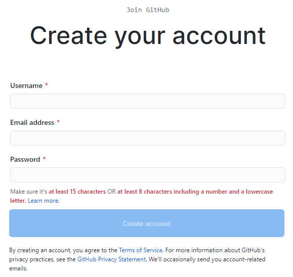

# Cloning GitHub Repositories and Creating Pull Requests

Learn to use the GitHub web application and Git command line tools to clone a Git repository, make changes and create a pull request for merging your changes into the source project.

## Pre-requisites

The following software and tools are used:

1. Chrome browser (version 85.0.4183.121).
You can use a browser of your choice to download Git.
  
2. Windows 10™ operating system.

## Logging into GitHub

GitHub is a web application and online repository based on the Git version control system.
The GitHub web application allows browsing existing repositories, and performing certain maintanence tasks
in the browser, such as creating a new repository, cloning existing repositories, making simple file changes, 
committing the changes, merging into source project using pull requests, etc. 

To log into GitHub:
1. Open the link [https://github.com/](https://github.com/) in your web browser. If are already signed in, proceed to the next section.
2. To sign in, if you already have an account, choose **Sign In** from the top-left menu.
3. Enter your user name and password, click **Sign In**.

> 💡 If you don't have a GitHub account, select **Sign In** or follow the link [https://github.com/join](https://github.com/join) to sign up.
> Enter **Username**, **Email** and **Password**, and select **Create Account**. Follow the directions to verify your email address. 
> 

- [Installing Git](Installing_Git.md)   This tutorial is intended for novice Git users and guides you through the step-by-step Git Setup Wizard. You will need to install Git to use the command line tool.

- [Setting Up SSH Key](SSH_Key.md)   Procedures to generate, set up an SSH key and use it with a GitHub account.

...

Congratulations! You have successfully completed cloning GitHub repository and creating pull request.

## Resources
The following are extra resources to help you through the installation process. 
1. Installing Git:   https://git-scm.com/book/en/v2/Getting-Started-Installing-Git
2. How to Install Git on Windows:   https://phoenixnap.com/kb/how-to-install-git-windows

