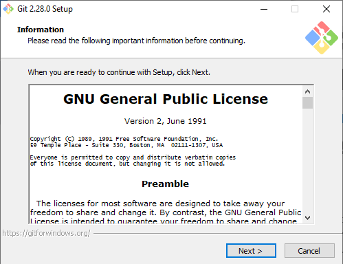

# Installing Git

This tutorial is intended for novice Git users and guides you through the step-by-step Git Setup Wizard. You will need to install Git to use the command line tool. The following software and tools are used:

1. Chrome browser (version 85.0.4183.121).
You can use a browser of your choice to download Git.
  
2. Windows 10™ operating system.

3. Git Setup (version 2.38.0).
This will automatically download when you run the executable file.

## Installing Git for Windows

1. Open a browser and go to [https://git-scm.com/download/win](https://git-scm.com/download/win) to download Git.

2. Select the hyperlink applicable to your system setup. This tutorial uses the **64-bit Git for Windows Setup** hyperlink.
An executable (.exe) file appears in the lower left corner of your browser window. 

3. Click the .exe file to start the Git Setup Wizard. 

## Configuring Git with the Git Setup Wizard

This section guides you through the Git Setup Wizard in explicit detail. If you are already familiar with Git, proceed through the wizard prompts.

1. Accept the **GNU General Public License** on the **Information** screen and click **Next**.

2. Select the where you want to install Git and click **Next**. Click the **Browse** button to customize the installation location. By default, Git will install on your local drive.

3. Check the components you want to install on the **Select Components** screen and click **Next**. 
The recommended defaults are already selected. For quick access to Git, install all the icons to your Desktop.

4. Click the drop-down menu and select the default editor you want Git to use and click **Next**.
Which text editor to use? It is a personal preference. If you are unfamiliar with text editors, Notepad++ is a good choice. Text editors like Vim or Emacs are very powerful, but require a steep learning curve.

 
5. Select where Git Setup places the Git program shortcuts and click **Next.** Select **Browse** to customize the folder location for the shortcuts.

6. Choose how you would like to use Git from the command line in the **Adjusting your PATH environment** screen and click **Next**.
The recommended option is to select **Git from the command line and also from 3rd-party software**.

 
7. Select which SSL/TLS library you want Git to use for HTTPS connections and click **Next**.
SSL/TLS libraries use certificates to validate secure communications between Internet clients and servers.

8. Select which terminal emulator you want to use with your Git Bash and click **Next**.
Terminal emulators enable a machine to connect to and communicate with another machine using a command-line or graphical interface.

 

9. Choose the default behavior of 'git pull' and click **Next**.

10. Configure how Git treats line endings in a text file. By default, **Checkout Window-style, commit Unix-style line endings** is selected. 
This relates to the way data is formatted and changing this option may cause problems.
         

11. Choose a credential helper and click **Next**.
The credential helpers are external programs from which Git can request both usernames and passwords. These are used so you don't have to type in a username and password every time when accessing a program. Credential helpers can cache your credentials in memory for a short period of time or store credentials indefinitely on disk.

   
12. Choose to configure extra features and click **Next**. By default, **Enable file system caching** is selected. Enabling system caching provides a significant performance boost.
 **Enable symbolic links** requires permissions. Symbolic links make sure files are in consistent places without moving or copying the original. Multiple copies of the same file can exist in different places, but only one file is referenced.

 
13. Choose to configure experimental bleeding-edge features and click **Install**. For novice Git users this feature is not recommended. Bleeding-edge features relates to the latest innovative technologies or software builds, which can result in an unstable environment.

 

14. Wait while Git Setup extracts files to install on your computer. When the installation completes, the wizard forwards you to the next screen. Click **Next** to exit the Git Setup Wizard.

15. Verify the settings on the **Completing the Git Setup Wizard** screen and
select **Launch Git Bash** and **View Release Notes**. Git Bash is the command line utility you will need to communicate with Git.

## Verifing Installation
To verify successful installation you will need to launch the Git command line. 

1. Open the Windows Start menu.
2. Enter `git`.
3. Choose **Git Bash** from the search results. The Git Bash terminal window appears.
4. Enter `git --version` in the command prompt.

Congratulations! You have successfully installed Git.

## Resources
The following are extra resources to help you through the installation process. 
1. Installing Git: https://git-scm.com/book/en/v2/Getting-Started-Installing-Git
2. How to Install Git on Windows: https://phoenixnap.com/kb/how-to-install-git-windows

